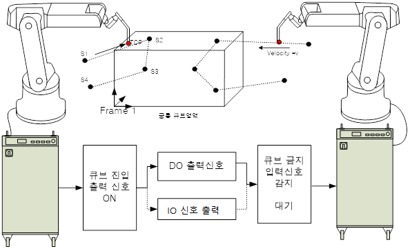

# 1. 개요

1.1 기능의 목적

–	재생 중에 여러 로봇이 동시에 동일 큐브 영역에 진입하는 것을 방지합니다.

–	로봇의 툴 끝 위치(TCP)가 설정된 큐브 영역에 진입한 경우 신호를 출력함으로써 사용자가 이 신호를 이용하여 다양한 응용을 가능하도록 합니다.

1.2 기능의 범위

1) 로봇 프로그램을 기동 중인 경우
–	로봇의 TCP가 설정한 큐브의 영역의 내부에 존재하면 할당된 신호 출력이 ON되고 외부에 존재하면 신호출력이 OFF됩니다.
–	어떤 한 로봇의 TCP(툴 끝 위치)가 큐브 영역에 진입했거나 그 로봇이 스텝 진행 중에 스텝 목표 위치가 큐브 영역에 진입하면 그 영역에 대한 작업 우선권을 확보하고 큐브 진입 출력신호를 출력합니다.(위의 그림에서 좌측 로봇)
–	큐브 진입 출력신호는 다른 로봇(위의 그림에서 오른쪽 로봇)에게는 큐브금지 입력신호로 입력되고 입력을 받은 로봇은 큐브 간섭이 예상될 경우 자동으로 정지합니다.
–	먼저 큐브 영역에 진입한 로봇의 작업이 완료되면 대기하던 로봇은 자동으로 재기동 됩니다.

2) 로봇 조그 혹은 정지 중인 경우
–	수동 모드(조그)에서는 TCP위치를 검지하여 큐브 진입 출력 신호를 출력하는 역할을 수행합니다. 
–	조그 동작시에는 큐브 금지 입력신호가 입력되더라도 자동으로 정지하지 않으므로 주의하여 사용하십시오.

1.3 기능의 제한사항 

본 기능은 큐브에 동시에 진입이 예상될 경우 자동으로 정지하고 큐브의 진입금지 입력 신호가 클리어 되면 자동으로 재기동 하도록 설계되어 있습니다. 

그러나 만일 큐브 진입 금지 입력신호를 감지한 시점에 최대한 감속하여 정지함에도 불구하고 큐브 영역에 동시에 진입할 수 밖에 없는 경우가 있습니다. 이 경우를 Dead-Lock이라고 합니다. 

공통 큐브에대해 큐브 진입 출력 신호와 큐브 금지 입력 신호 연결이 잘못되어 있거나, 두 로봇간의 통신 지연으로 Dead-Lock이 발생할 수 있습니다. 이 경우에는 두 로봇이 큐브 영역에 동시에 진입할 수 있으며 에러가 발생합니다. (E0222 동일 큐브 동시 진입금지)

- 본 기능은 두 로봇이 동시에 공통 큐브 영역에 진입하는 Dead-Lock현상이 발생할 수 있습니다.
- 데드락(dead-lock)상태를 자동 회피하여 원점으로 복귀하는 기능은 지원하지 않습니다.
- Arm 간섭 검지 기능과 연동하여 사용할 수 없습니다.
