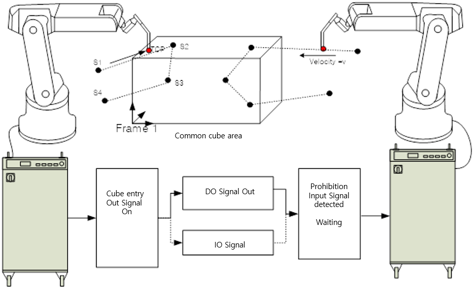

# 1. Overview

## 1.1 Purpose of the Function

- Prevent multiple robots from simultaneously entering the same cube area during playback.  
- When the robot's tool center point (TCP) enters a defined cube area, a signal is output, allowing the user to utilize this signal for various applications.

## 1.2 Scope of the Function

### 1) When the robot program is running
- If the robot's TCP is inside the defined cube area, the assigned output signal turns **ON**; if it is outside, the signal turns **OFF**.  
- When a robot's TCP enters the cube area, or when its step target position enters the cube area during step execution, that robot gains priority for the area and outputs a cube-entry signal (left robot in the figure above).  
- The cube-entry output signal is received by the other robot (right robot in the figure above) as a cube-prohibition input signal, and the receiving robot automatically stops when cube interference is expected.  
- When the robot that first entered the cube area completes its operation, the waiting robot automatically restarts.

### 2) When the robot is jogging or stopped
- In Manual Mode (Jog), the system detects the TCP position and outputs the cube-entry signal.  
- During jog operation, even if the cube-prohibition input signal is received, the robot **does not** automatically stop, so caution is required.

## 1.3 Limitations of the Function

This function is designed to automatically stop the robot when simultaneous entry into a cube is expected and to automatically restart once the cube-prohibition input signal is cleared.

However, even if the robot decelerates as much as possible when a cube-prohibition input signal is detected, there may be cases where simultaneous entry into the cube area cannot be avoided. This situation is called a **dead-lock**.

A dead-lock may occur if the cube-entry output signal and cube-prohibition input signal are incorrectly connected for a shared cube, or due to communication delays between two robots. In such cases, both robots may enter the cube area simultaneously, resulting in an error:  
**E0222 - Same cube simultaneous entry detected**.

- A dead-lock condition may occur when two robots attempt to enter a shared cube area simultaneously.  
- Automatic avoidance of dead-lock or automatic return-to-home recovery is **not supported**.  
- This function **cannot** be used in conjunction with the Arm Interference Detection function.