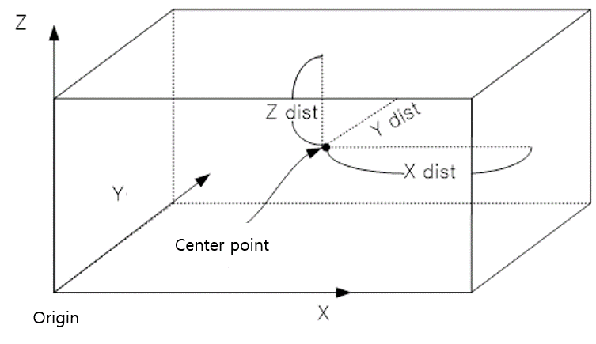
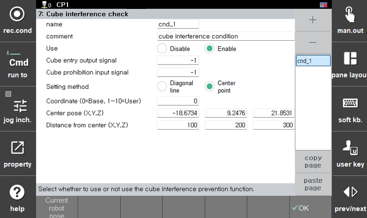

# 2.1 立方体区域设置方法

提供两种定义立方体区域的方法。

---

### 2.1.1 对角点法

- 此方法通过指定六面体的两个对角点来定义立方体。  
  如插图所示，您手动输入起始和结束对角位置。
- 要记录机器人当前的TCP位置，请将光标放在**<起始位置>**或**<结束位置>**上，然后按`当前 机器人姿势 (Current robot pose)`。  
  当前TCP位置将被保存为选定位置。
- 设置示例
    

### 2.1.2 中心点法

- 此方法设置立方体的中心点以及X、Y和Z方向上的距离。
- 记录立方体区域的中心点位置，并单独设置从中心点到X、Y和Z方向的距离。
- 要将中心点记录为机器人当前TCP位置，请将光标放在**<中心位置>**上，并按`当前机器人姿势`按钮以保存当前位置信息。

- 设置示例  
  