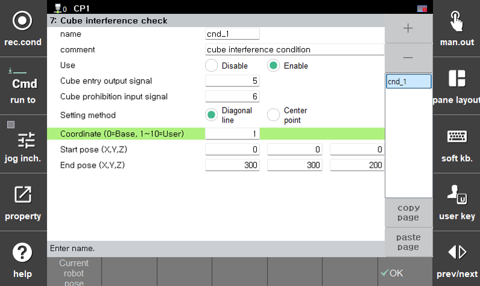
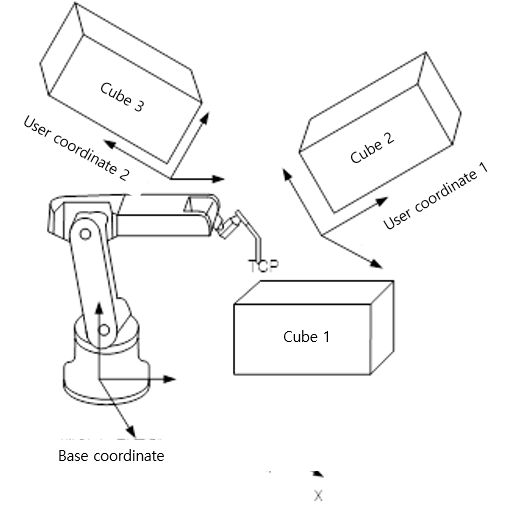
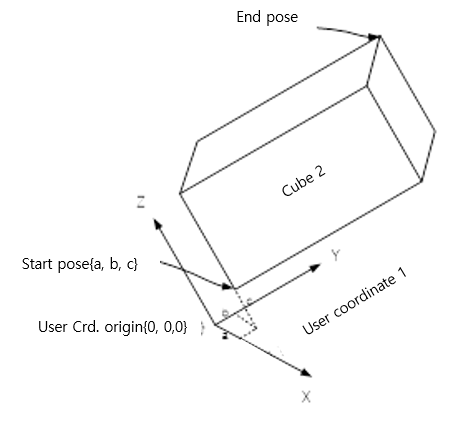

# 2.2 Setting the Coordinate System Number

You can specify the position of the cube in space using either the base coordinate system or a defined user coordinate system, depending on the cube setting method.  

If the coordinate system number is set to **"0"**, the cube area is configured using positions defined in the **base coordinate system**.  
If the coordinate system number is **"1" or higher**, the cube area is defined using positions based on the corresponding **user coordinate system**.

### Coordinate System Number
- Set to the base coordinate system
    - When the coordinate system number is set to 0, the cube area is defined using positions defined in the base coordinate system.

- Set to a user coordinate system
    - When the coordinate system number is set to 1 or higher, the cube area is specified using positions in the user coordinate system corresponding to that number.
    - When using a user coordinate system, both the diagonal position and the center position must be set within the user coordinate system.

  
Even if you change the coordinate system, the positions defined for the cube area do **not** update automatically. Therefore, the cube may be assigned to a location different from what the user intended, so caution is required.


- When using a **user coordinate system**, both the diagonal point and the center point **must be defined within the user coordinate system**.

