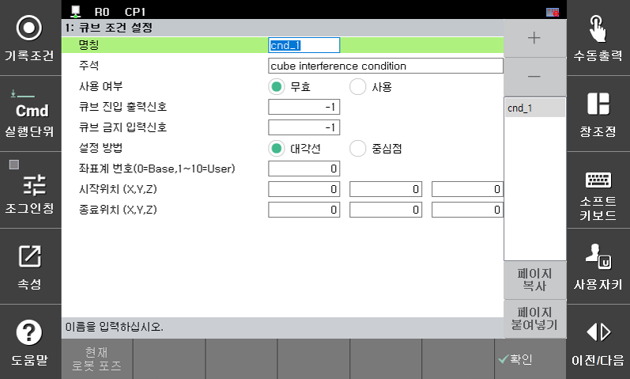

# 2. 관련 기능

2.1 큐브 영역 설정

『시스템』 → 『4: 응용파라미터』 → 『7: 간섭방지』→ 2: 큐브 조건 설정』을 선택합니다.

큐브 조건은 화면 우측 (+) 버튼 또는 (-) 버튼을 통해 추가하거나 제거 할 수 있습니다. 
개별 큐브 조건에 대해 사용 여부를 설정하고 큐브 진입 시 출력 신호를 출력할 포트와 큐브 진입을 금지하기 위한 입력 신호를 각각 설정 합니다. 

