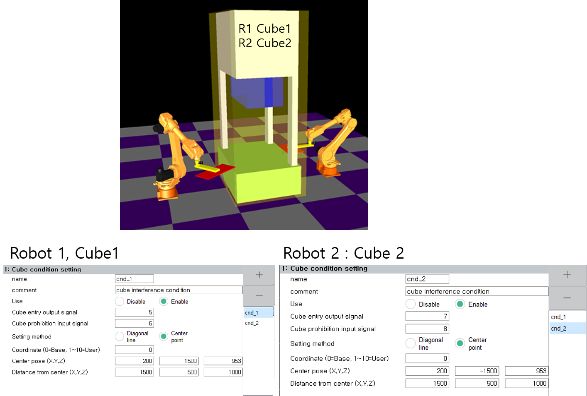
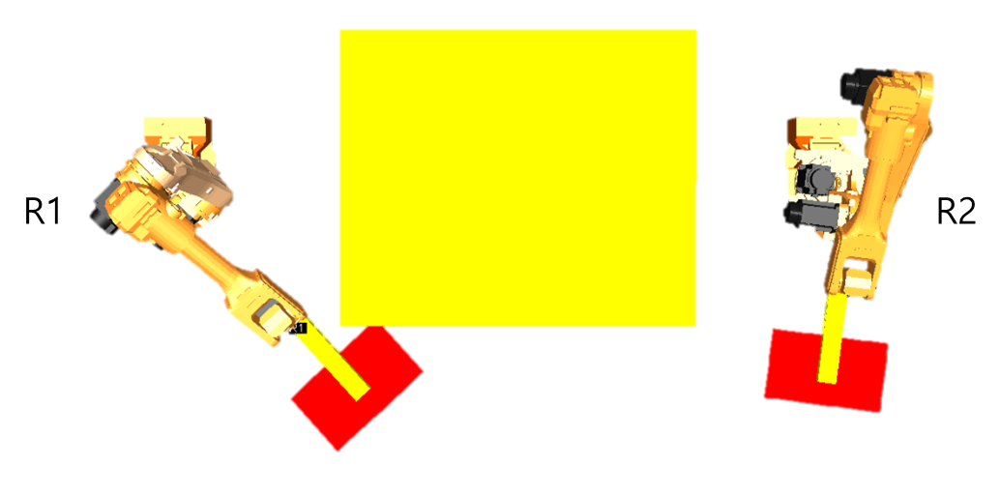
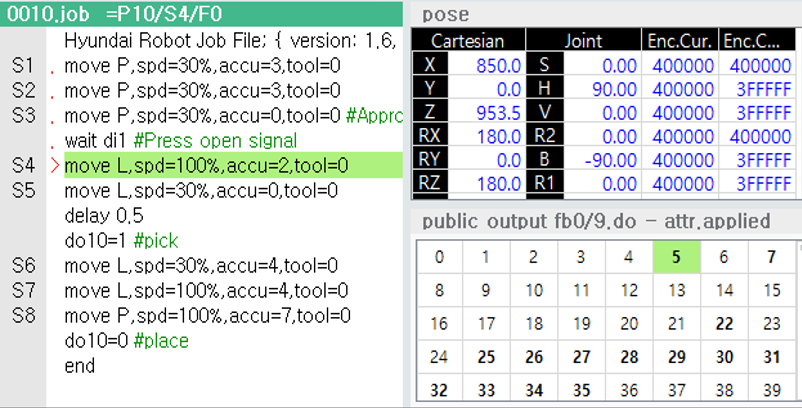
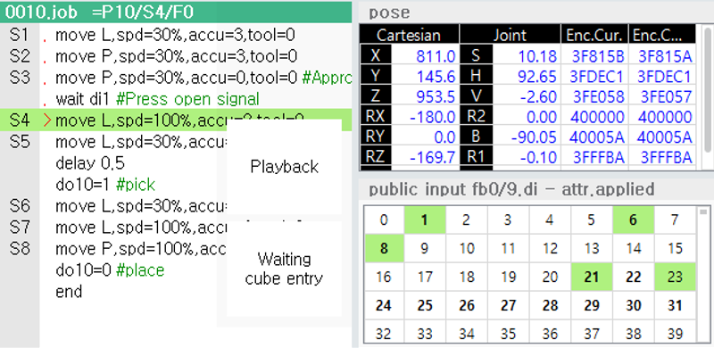

## 2.3 Example of Creating and Executing a Work Program

Set cube areas of the same size at the same spatial location for each robot.  
At this time, ensure that the cube positions are defined according to the coordinate system selected for each robot.

---

### **• Robot 1: Cube-entry Output Signal ON, Robot 2: Cube-prohibition Signal ON**

When Robot 1’s target position lies inside the defined cube area, the cube-entry output signal turns ON.  
Even if the target position is not inside the cube, the signal will turn ON if the robot enters the cube area during movement.

---

### **[Robot 1 Example]**

- In this example, steps S4 to S7 are assumed to enter the cube area.

To prevent dead-lock caused by simultaneous cube entry with the other robot,  
**the step immediately before entering the cube must be set as a non-continuous step (A = 0).**  
Alternatively, commands such as **WAIT** or **DELAY** may be used before entering the cube to intentionally create a non-continuous condition.

---

### **[Robot 2 Example]**

- In this example, Robot 1 (R1) is already inside the designated cube area, and Robot 2 attempts to enter the cube area defined in steps S4 to S7.

If the other robot is already inside the cube area, or is moving with the intention of entering it, the cube-prohibition signal (**di8**) is received.  
If Robot 2’s next target position lies inside the cube area, Robot 2 will stop and wait.  
During this waiting state, the teach pendant displays the message:  
**“Waiting cube entry.”**

Once the other robot exits the cube area, Robot 2 automatically resumes operation.
