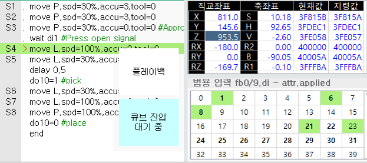

2.3 작업 프로그램 작성 및 실행 예 

공간상에 동일한 위치에 동일한 크기의 큐브 영역을 각각의 로봇들에 설정 합니다. 
이때, 큐브 위치는 각각의 로봇에서 선택한 좌표계 선택에 맞추어 지정 될 수 있도록 주의 하십시오. 

 
* 로봇 1의 큐브진입 출력신호 On 상태, 상대(로봇2)의 큐브 금지 신호 On상태

로봇 1의 이동 목표 위치가 지정된 큐브 영역 내부에 있는 경우, 큐브진입 출력 신호가 On 됩니다. 목표 위치가 큐브 내부가 아니더라도 이동 중 큐브영역에 진입 하는 경우에도 진입 신호가 On 됩니다. 

**[로봇 1의 적용 예시]** 
*  본 예시는 S4~S7 이 큐브 영역 내부로 진입하는 경우를 가정 합니다. 
   
 상대 로봇과 동시에 큐브 내부로 진입하는 데드락 방지를 위해 큐브 진입 직전 스텝은 반드시 불연속으로 설정(A=0) 해주십시오. 또는 필요 시 큐브 진입 직전 wait 또는 delay 등의 명령을 통해 불연속 조건을 만들 수 있습니다.   

**[로봇 2의 적용 예시]**  
* 본 예시는 상대 로봇(R1)이 지정된 큐브에 이미 진입한 상태에서 로봇 2가 S4~S7 에 저장된 큐브 영역 내부로 진입하고자 하는 경우를 가정 합니다. 
   
상대 로봇이 이미 큐브 내부에 진입했거나, 진입 하고자 이동하는 중인 경우 큐브 진입금지 신호 (di8)이 입력됩니다. 이 때, 로봇 2의 다음 목표 위치가 큐브 내부인 경우 로봇 2는 동작을 정지하고 대기하게 됩니다. 대기 중인 경우 TP 화면에 “큐브 진입 대기중” 메시지가 표시 됩니다. 이후 상대 로봇이 큐브 영역을 이탈하게 되면 자동으로 동작을 재개합니다. 