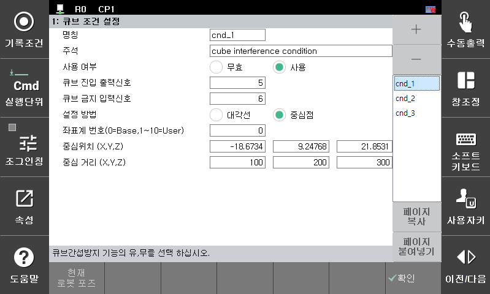
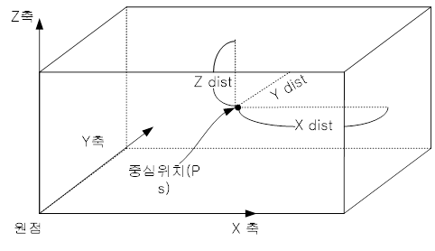

* 중심점 설정방법  
–	중심점 설정 방법은 큐브의 중심점과 X방향, Y방향, Z방향 거리를 각각 설정하는 방식입니다.  
–	중심점을 현재 로봇의 TCP 위치로 기록하려면 <중심위치>에 커서를 놓고 ‘ENTER’ 키를 누르면 현재의 위치로 기록할 수 있습니다.  

  설정 예)

  </img>
   

   큐브 영역의 중심점 위치를 기록하고 중심점으로 부터 X, Y, Z 방향에 대한 거리를 각각 설정 합니다. 