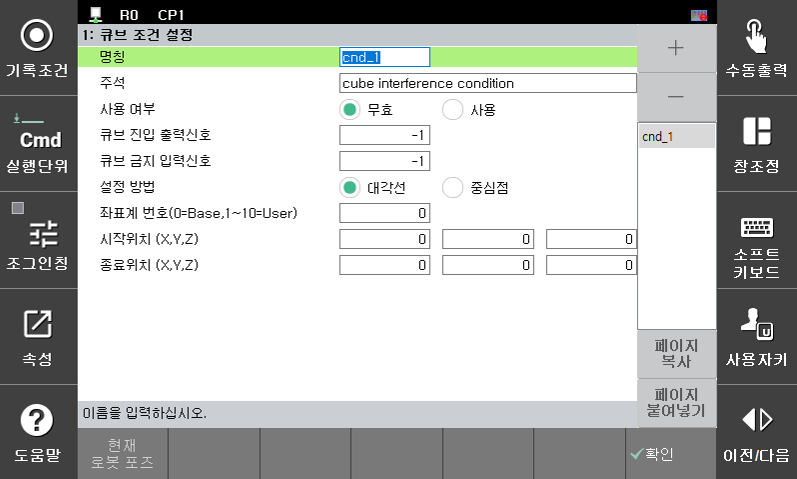

* 좌표계 번호 설정  

  큐브의 설정 방법에 따라 공간상의 위치를 베이스 좌표계 또는 지정 사용자 좌표계를 통해 공간상의 위치를 지정할 수 있습니다.  
  좌표계 번호가 "0" 으로 설정된 경우 베이스좌표계상에 정의된 위치들을 활용하여 큐브 영역을 설정 합니다.  
  좌표계 번호가 "1" 이상인 경우 해당 번호에 대응하는 사용자 좌표계 상의 위치를 통해 큐브 영역이 지정 됩니다.   
  
  
 좌표계를 변경 하더라도 큐브 영역 정의를 위해 지정된 위치들은 자동으로 변경 되지 않으므로 사용자의 의도와 다른 위치에 큐브 영역이 지정 될 수 있으므로 주의가 필요합니다.
  

  

  
–	유저 좌표계로 설정하는 경우에는 반드시 대각 위치와 중심위치를 유저 좌표계 위에서 설정하여야 합니다.  

  </img>
  </img>

