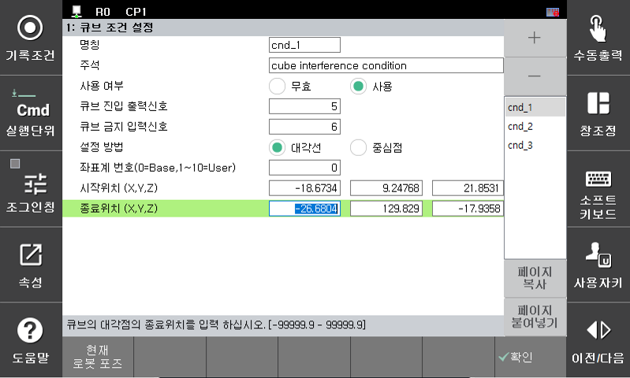
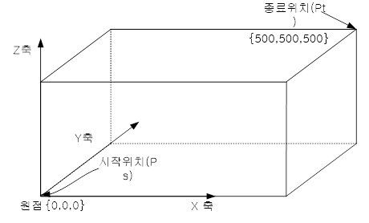

1) 큐브 영역설정 방법  
큐브의 설정 방법은 2가지로 제공됩니다.

* 대각점 설정방법  
–	대각점은 육면체의 대각 위치 두 점을 설정합니다. 아래의 그림처럼 대각의 시작위치와 종료위치를 직접 입력합니다.  
–	현재 로봇의 TCP 위치로 기록하려면 <시작위치> 혹은 <종료위치> 버튼에 커서를 놓고 ‘ENTER’ 키를 누르면 현재의 위치로 기록할 수 있습니다.  

  설정 예)

  </img>
   

