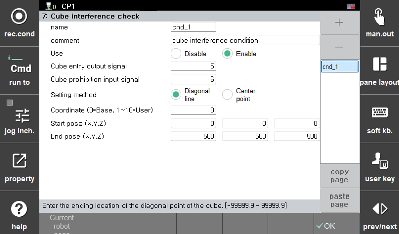
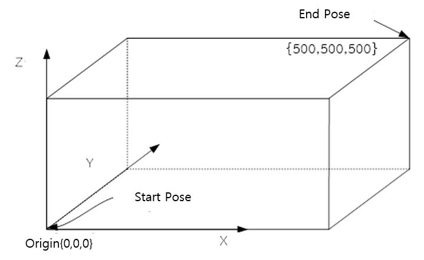

### 1) Cube Area Setting Methods

Two methods are provided for defining a cube area.

---

### • Diagonal Point Method

- This method defines a cube by specifying two diagonal points of the hexahedron.  
  As shown in the figure below, you directly enter the starting and ending diagonal positions.  
- To record the robot's current TCP position, place the cursor on the **<Start Position>** or **<End Position>** button and press **ENTER**.  
  The current TCP position will be saved as the selected position.

**Example Setting**

  
  

