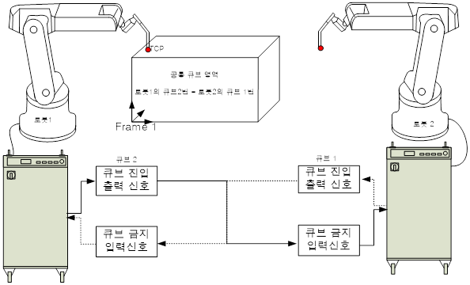

* 큐브 입출력 신호 설정 
  
–	큐브진입 출력신호 : 자신의 로봇이 해당 큐브 영역에 진입했는지를 검지하여 신호로 출력해주는 기능입니다. 큐브 진입 출력신호에 이 신호번호를 설정합니다.  
–	큐브금지 입력신호  : 다른 로봇이 해당 큐브 영역에 진입했을 경우 신호를 입력 받기 위한 신호 번호를 설정합니다.  

  상기 로봇에서 두 로봇의 공통 큐브 영역은 로봇 1의 큐브 2와 로봇 2의 큐브 1번입니다. 이와 같은 경우 로봇 1의 큐브2의 ‘큐브 진입 출력신호’ 신호를 로봇 2의 큐브 1번‘큐브 금지 입력신호’에 연결하고 로봇2의 큐브 1번 ‘큐브 진입 출력신호’신호를 로봇1의 큐브 2번 ‘큐브 금지 입력신호’에 연결합니다.
 
 

  </img>

