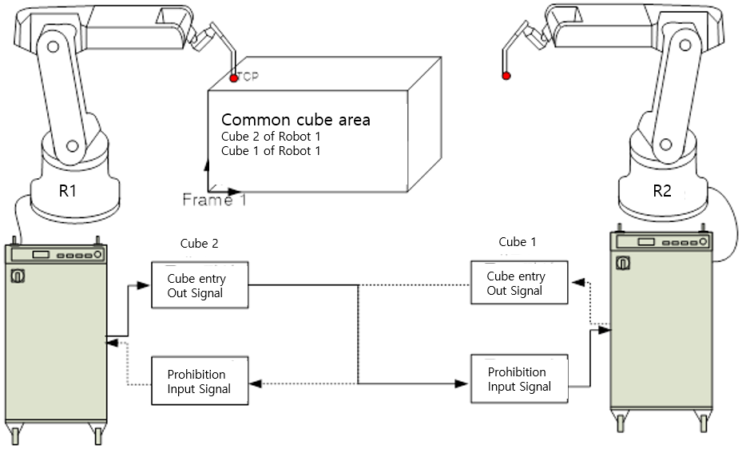

### • Cube I/O Signal Settings

- **Cube-entry Output Signal**:  
  This signal indicates whether the robot itself has entered the designated cube area.  
  Assign the appropriate signal number to the cube-entry output signal field.

- **Cube-prohibition Input Signal**:  
  This signal number is assigned to receive an input when another robot enters the same cube area.

In the example shown above, the common cube area shared by the two robots is **Cube 2 of Robot 1** and **Cube 1 of Robot 2**.  
In this case:

- Connect **Robot 1 – Cube 2 (Cube-entry Output Signal)** → **Robot 2 – Cube 1 (Cube-prohibition Input Signal)**  
- Connect **Robot 2 – Cube 1 (Cube-entry Output Signal)** → **Robot 1 – Cube 2 (Cube-prohibition Input Signal)**

  

